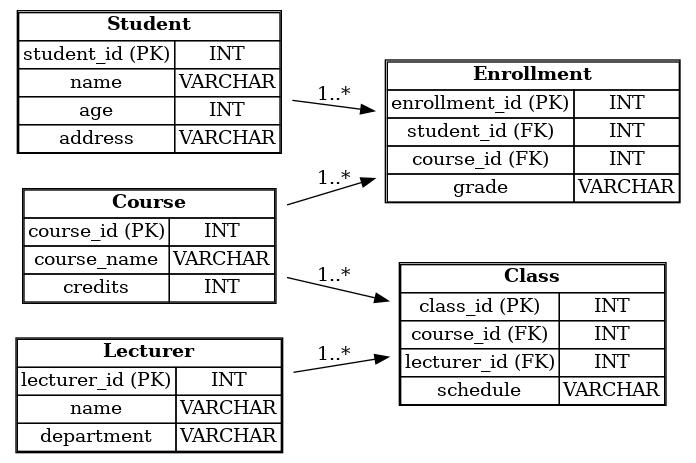

# Project Scope – Yoobee College Database
The Yoobee College database will manage core academic and administrative records, focusing on students, lecturers, courses, and classes. It will centralize enrollment, and course offerings to ensure accurate, efficient, and accessible information management for the college.


## Entities and Attributes
```

1. Student
       Attributes: StudentID, Name, Age, Address, Email
       Role: Stores student personal and enrollment details.

2. Lecturer
       Attributes: LecturerID, Name, Department, Email
       Role: Stores lecturer information.

3. Course
       Attributes: CourseID, CourseName, Credits, Department
       Role: Defines subjects offered by the college.

4. Class
       Attributes: ClassID, CourseID, LecturerID, Schedule
       Role: Links courses, lecturers, and student groups.

5. Enrollment
       Attributes: EnrollmentID, StudentID, ClassID, Grade
       Role: Tracks which students are enrolled in which classes.
```

## Table Design (Relational Schema) ref: yb_college_db_diagram.jpeg
```
Total tables: 5

1. Student
      PK: StudentID
      Columns: Name, Age, Address, Email

2. Lecturer
      PK: LecturerID
      Columns: Name, Department, Email

3. Course
      PK: CourseID
      Columns: CourseName, Credits, Department

4. Class
      PK: ClassID
      FKs: CourseID → Course.CourseID, LecturerID → Lecturer.LecturerID
      Columns: Schedule (e.g., day/time/room)

5. Enrollment
      PK: EnrollmentID (or composite PK: StudentID, ClassID)
      FKs: StudentID → Student.StudentID, ClassID → Class.ClassID
      Columns: Grade (nullable)
```
